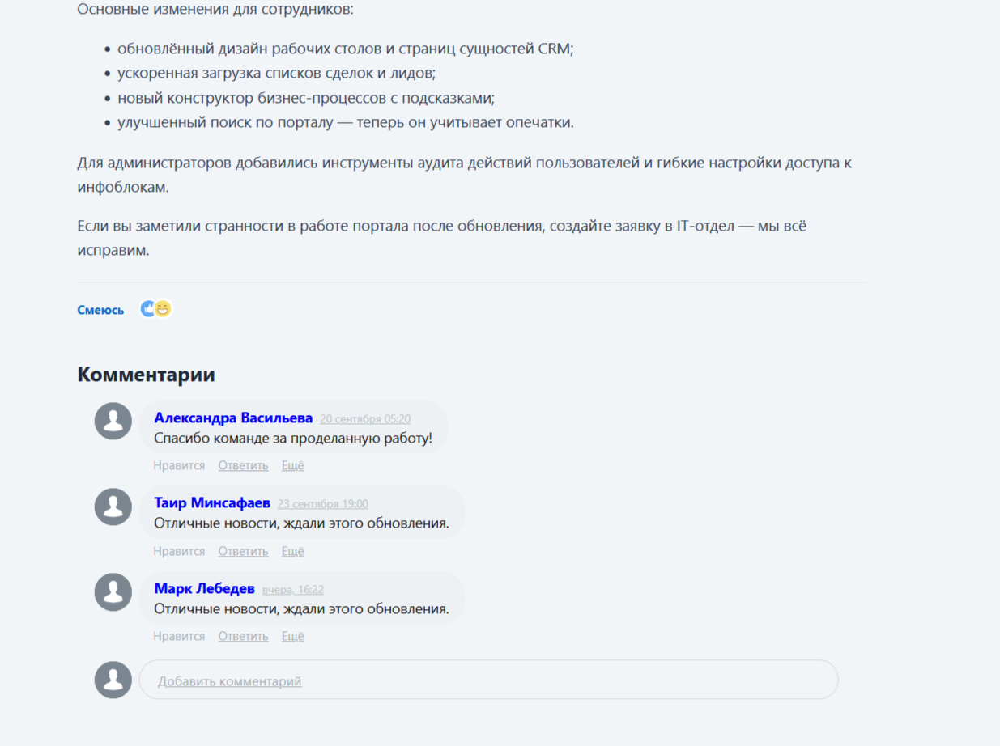

# mtai.news

Лента новостей для Bitrix24 на инфоблоке с расширенными правами.




## Что внутри

- **Инфоблок** `mtai_news` (тип `mtai_news`, RIGHTS_MODE=E: G1→X, G2→R):
  разделы — категории новостей, элементы — новости. Свойства
  `BLOG_POST_ID`/`BLOG_COMMENTS_COUNT` заводит штатный `bitrix:catalog.comments`.
- **Компонент `mtai.news:feed`** — лента карточек: лайки-реакции живой ленты
  (`bitrix:rating.vote` like_react), счётчик просмотров
  (`bitrix:socialnetwork.contentview.count`), число комментариев,
  фильтр по категориям, аякс-подгрузка при скролле (эндпоинт `/news/ajax.php`
  отдаёт частичный рендер шаблона `page` в JSON), восстановление позиции
  ленты при возврате по кнопке «Назад» браузера (history.state).
- **Компонент `mtai.news:detail`** — детальная новость: фиксация просмотра
  (`b_sonet_user_content_view`, уникально по пользователю), лайки, комментарии
  Живой ленты (`bitrix:catalog.comments`, шаблон `stream`). Обработчик
  `OnPostAdd` выдаёт автосозданному посту блога коды `BLOG_POST_RIGHTS`
  (по умолчанию `G2`) — без этого сотрудники не видят комментарии.

## Установка

Из php-контейнера:

```
php /var/www/html/local/tools/news_module_install.php            # модуль + демо-контент
php /var/www/html/local/tools/news_module_install.php seed       # только демо-контент
php /var/www/html/local/tools/news_module_install.php uninstall  # снос модуля и контента
```

Страница ленты: `/news/`, детальная: `/news/{ID}/`.
